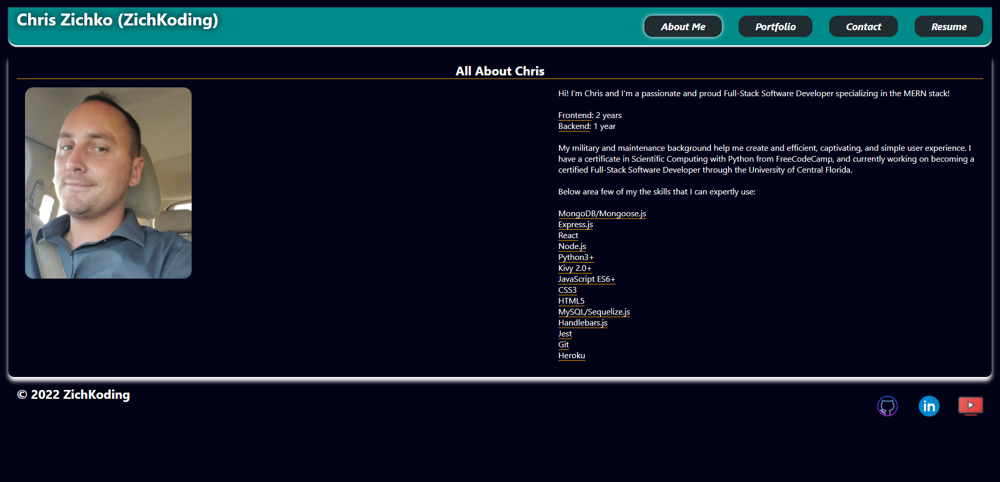
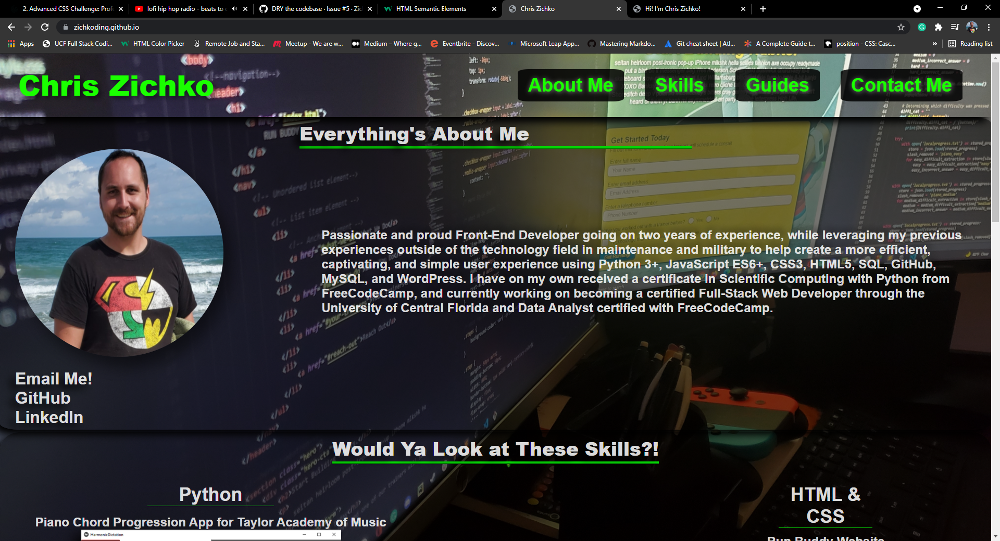

# ***Chris Zichko's Portfolio Powered by ZichKoding***
***Version 3 Coming Soon!***

# ***Chris Zichko's Portfolio Powered by ZichKoding***
***Version 2***

[_Click here for live page!_](https://zichkoding.github.io)

## ***Description***
This is my portfolio that I have created showcase my skills and abilities for myself and for my brand ***ZichKoding***. Of course, no matter how well I present myself there is **always** room for improvement, and that is exactly what I plan to do throughout my career as a Full-Stack Software Developer.
#
### ***Table of Contents***
* [About Me](#AboutMe)
* [Portfolio](#Portfolio)
* [Contact](#Contact)
* [Resume](#Resume)
#
### **AboutMe**
The About Me section is to give a quick down and dirty of who I am and what I can do along with the years experience I have. 
#
### **Portfolio**
The Portfolio section brings you to a few of my favorite projects and two of them are collaborative efforts where I worked with a team to complete the application, ***TuneItUp Eleven:Eleven***
#
### **Contact**
Contact section brings you to a Contact form that you can enter and submit, which when you click submit it will open your email up with my email address to contact me.
#
### **Resume**
My Resume section displays my resume and allows the user to download a PDF of my resume. Also, this section displays some of my skills, as well.
#
#
#
#
#
#
# **Welcome ZichKoding's/Chris Zichko's portfolio!**
Version 1

_Click the photo below for live website_

## **Table of Contents**

* Navigation
* About Me
* Projects
* Contact Me

### **Overview**
This is my portfolio that I will be updating continuously to improve and refine my skills as I grow as a Software Developer. 

My current skills are in Python 3+, JavaScript ES6+, CSS3, HTML5, SQL, GitHub, MySQL, Kivy, and WordPress. My strongest out of these skills are Python, JavaScript, CSS, HTML, and Kivy.

### **Navigation**
The navigation bar will take you to various places on the website except Guides. This is an addition that is planned, but will be slowly updating as I continue to grow. 

### **About Me**
This section is where I have listed a few links to contact me along with a recent picture. This is where I have written a tiny summary showing off my passion for developing software.

### **Projects**
This section I have provided screenshots that are also links to interactive projects that I have made.

 However, Piano Chord Progression app will just be directed to my GitHub repository containing the code only. I am currently adding this to Repl and plan on embedding it into my portfolio.

 ### **Contact Me**
 Here is where I have left some additional ways to contact me. I have, also, left an embedded map of what city and state I reside in. 
